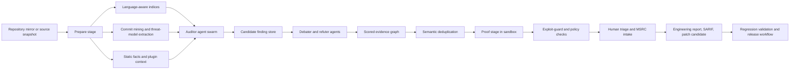
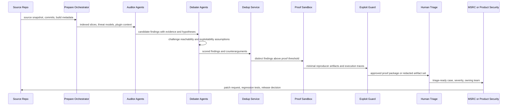

# Microsoft MDASH AI Security System

## Executive summary

Microsoft has publicly described MDASH as a **multi-model agentic scanning harness** for vulnerability discovery and remediation, built by its Autonomous Code Security team and used with Microsoft research and Windows security groups. According to Microsoft, MDASH orchestrates **more than 100 specialized agents** across a mix of **frontier and distilled models**, moving findings through a staged pipeline of **prepare, scan, validate, dedup, and prove** before they are handed to engineering teams. In Microsoft’s May 12, 2026 disclosure, the company said MDASH helped find **16 vulnerabilities** in the Windows networking and authentication stack, including **four Critical remote code execution flaws**, and that the system is already in internal use plus a **limited private preview** with selected customers. citeturn5view0turn29search0

The same Microsoft disclosure publishes unusually concrete performance numbers: **21/21 seeded vulnerabilities found with zero false positives** on a private test driver, **96% recall** on five years of confirmed MSRC cases in `clfs.sys`, **100% recall** on five years of historical cases in `tcpip.sys`, and an **88.45%** score on the public CyberGym benchmark. Microsoft explicitly argues that the strategic differentiator is not any one model, but the **agentic system around the models**. citeturn5view0turn34view1turn22search1turn22search7

A rigorous reading of the sources also reveals a few caveats. Microsoft has **not disclosed the exact model lineup, fine-tuning recipes, proprietary plugins, or production deployment topology** for MDASH. In addition, there is a **public-record inconsistency** around two of the best-explained bugs: Microsoft’s May 12 MDASH post presents them as part of that day’s “Patch Tuesday cohort,” but both the MDASH deep-dive text and NVD records indicate **CVE-2026-33824** and **CVE-2026-33827** were patched in **April 2026**. That does not undercut the broader claim that MDASH found 16 Windows vulnerabilities, but it does mean the exact month-of-shipment for those two CVEs is mixed in public sources. citeturn34view0turn34view1turn18search0turn18search1

The report below therefore separates **documented facts** from **near-implementation assumptions**. Where Microsoft has spoken precisely, I preserve that precision. Where internals are undisclosed, I reconstruct a plausible high-level implementation using Microsoft’s own descriptions, the public CyberGym benchmark, DARPA AIxCC / Team Atlanta lineage, and the open Atlantis repositories as engineering analogs rather than as proof that MDASH uses the exact same code or stack. citeturn5view0turn22search0turn21search9turn30view0turn31view0turn32view0

## Source landscape and what is actually established

Per your instruction, the review began with Reddit and explicitly checked these Reddit surfaces: **reddit.com, old.reddit.com, np.reddit.com, www.reddit.com, and m.reddit.com**. In indexed results, the substantive matches were standard Reddit link-posts and discussions, including posts in **r/AZURE**, **r/cybersecurity**, **r/SecOpsDaily**, and **r/accelerate**. Those posts are useful as a signal that the story propagated quickly through practitioner communities, but they mostly point back to Microsoft’s announcement or news coverage rather than contributing primary technical detail of their own. citeturn2view0turn2view1turn2view2turn9search4

After Reddit, the highest-confidence technical sources were Microsoft’s own MDASH announcement, Tom Gallagher’s MSRC note on Patch Tuesday, NVD/CVE records for individual vulnerabilities, CyberGym’s benchmark materials, and open AIxCC / Atlantis artifacts. ZDI and mainstream coverage are valuable mainly for independent prioritization and framing rather than for core architecture facts. A directly accessible PCMag article appears to exist, but the site was blocked to direct crawling during this review; its title and short summary were still observable through secondary indexing and social mirrors. citeturn5view0turn33view0turn18search0turn18search1turn22search1turn22search7turn20search13turn25search0turn25search10

| Source family | Evidence used here | What it establishes | Confidence and limitation |
|---|---|---|---|
| Reddit | r/AZURE, r/cybersecurity, r/SecOpsDaily, r/accelerate | Story propagation, practitioner reaction, linked coverage | Low for internals; mostly secondary discussion |
| Microsoft Security Blog | MDASH announcement by Taesoo Kim | Architecture stages, agent count, benchmark claims, 16-CVE cohort, preview status | Highest-confidence public source on MDASH itself |
| MSRC blog | Tom Gallagher Patch Tuesday note | Operational context: AI-driven discovery growth, validation and triage at scale, Patch Tuesday posture | High-confidence operational framing |
| NVD / CVE | CVE detail pages | Independent descriptions, CWEs, CVSS vectors, publication timing | High-confidence for individual CVE metadata |
| CyberGym paper and site | OpenReview, arXiv abstract, CyberGym site | Benchmark composition, task design, scale, historical baselines | High-confidence for evaluation context |
| Team Atlanta / ATLANTIS | arXiv abstract, public GitHub repos | Open engineering analogs for agentic cyber reasoning systems | Useful analogy, not proof of MDASH implementation |
| ZDI and news | ZDI May 2026 review, CSO, The Record, TechRadar | Independent prioritization, impact framing, broader trend context | Good corroboration; secondary on MDASH internals |
| PCMag | Indexed title / mirrors only | Confirms the article exists and aligns with official framing | Access limitation prevented direct verification |

Source comparison note: the table above is grounded in the Microsoft MDASH post, the MSRC Patch Tuesday note, NVD records, CyberGym materials, Team Atlanta artifacts, ZDI, CSO, The Record, and indexed PCMag references. citeturn5view0turn33view0turn18search0turn18search1turn18search2turn18search3turn22search1turn22search7turn22search0turn30view0turn31view0turn32view0turn20search13turn25search2turn35search1turn27news10turn25search0turn25search10

## Confirmed findings and the vulnerability cohort

Microsoft’s own cohort table lists **16 CVEs** found with MDASH across `tcpip.sys`, `ikeext.dll`, `http.sys`, `netlogon.dll`, `dnsapi.dll`, and `telnet.exe`. Microsoft further states that these were **10 kernel-mode** and **6 user-mode** issues, and that **the majority were reachable from a network position with no credentials**. The resulting vulnerability classes span **remote code execution, denial of service, information disclosure, security feature bypass, and elevation of privilege**. citeturn34view0

The four Critical entries are especially important because they map to core Windows infrastructure with broad enterprise blast radius. Microsoft’s list names Critical RCEs in the Windows TCP/IP stack, IKEEXT, Netlogon, and the DNS client; NVD corroborates the bug classes for the Netlogon and DNS issues as a **stack-based buffer overflow** and **heap-based buffer overflow**, respectively, each with network reachability and CVSS 9.8. citeturn34view0turn18search2turn18search3

ZDI’s Patch Tuesday review independently prioritized **CVE-2026-41089** in Netlogon and **CVE-2026-41096** in the DNS client as extremely urgent, and it also called out **CVE-2026-40415** in Windows TCP/IP as another network-reachable RCE with “wormable” characteristics, though with lower practical exploit likelihood because of the reported low-memory precondition. That external prioritization is useful because it shows the MDASH-discovered cohort was not a pile of trivial crashes; several findings landed squarely in the part of the risk spectrum defenders care about most. citeturn23search0turn20search0

### MDASH-discovered Windows cohort

| Component | CVE | Microsoft-described issue | Severity | Type |
|---|---|---|---|---|
| `tcpip.sys` | CVE-2026-33827 | SSRR IPv4 packets causing use-after-free | Critical | RCE |
| `tcpip.sys` | CVE-2026-40413 | NULL dereference via crafted IPv6 extension headers | Important | DoS |
| `tcpip.sys` | CVE-2026-40405 | ESP SA refcount underflow | Important | DoS |
| `ikeext.dll` | CVE-2026-33824 | IKEv2 SA_INIT double-free | Critical | RCE |
| `tcpip.sys` | CVE-2026-40406 | Use-after-free in `Ipv4pReassembleDatagram` | Important | Information Disclosure |
| `tcpip.sys` | CVE-2026-35422 | IPsec cross-SA fragment splicing via reassembly | Important | Security Feature Bypass |
| `tcpip.sys` / WFP path | CVE-2026-32209 | WFP RPC disables name cache | Important | Security Feature Bypass |
| `ikeext.dll` | CVE-2026-35424 | Memory leak | Important | DoS |
| `telnet.exe` | CVE-2026-35423 | OOB read in `FProcessSB` via malformed `TO_AUTH` | Important | Information Disclosure |
| `tcpip.sys` | CVE-2026-40414 | IPv6 + TCP MDL-split packet NULL dereference | Important | DoS |
| `tcpip.sys` | CVE-2026-40401 | ICMPv6 packet triggers `NdisGetDataBuffer` NULL dereference | Important | DoS |
| `tcpip.sys` | CVE-2026-40415 | Pre-auth remote use-after-free | Important | RCE |
| `http.sys` | CVE-2026-33096 | QUIC control-stream OOB read | Important | DoS |
| `tcpip.sys` | CVE-2026-40399 | Kernel stack buffer overflow via RPC blob | Important | Elevation of Privilege |
| `netlogon.dll` | CVE-2026-41089 | CLDAP `User=` filter stack overflow | Critical | RCE |
| `dnsapi.dll` | CVE-2026-41096 | Crafted UDP DNS response triggers heap OOB | Critical | RCE |

Cohort note: this table is taken from Microsoft’s published MDASH cohort list, with selected critical entries corroborated by NVD. citeturn34view0turn18search0turn18search1turn18search2turn18search3turn20search0turn20search1

### Threat-type distribution

| Threat type | Count in cohort | Representative CVEs | Defensive implication |
|---|---:|---|---|
| Remote code execution | 5 | CVE-2026-33827, CVE-2026-33824, CVE-2026-40415, CVE-2026-41089, CVE-2026-41096 | Highest patch urgency, especially for exposed network services |
| Denial of service | 6 | CVE-2026-40413, CVE-2026-40405, CVE-2026-35424, CVE-2026-40414, CVE-2026-40401, CVE-2026-33096 | Availability risk and potential crash/restart paths |
| Information disclosure | 2 | CVE-2026-40406, CVE-2026-35423 | Often useful in exploit chains and reconnaissance |
| Security feature bypass | 2 | CVE-2026-35422, CVE-2026-32209 | Can neutralize controls without direct code execution |
| Elevation of privilege | 1 | CVE-2026-40399 | Important when chained from adjacent compromises |

Threat-type note: counts are derived directly from Microsoft’s published cohort. citeturn34view0

### What the two deep dives reveal about MDASH’s strengths

Microsoft’s two most detailed examples are revealing because they show the kinds of bugs MDASH is optimized to find. **CVE-2026-33827** in `tcpip.sys` required reasoning about **reference ownership, race conditions, multiple concurrent free paths, and packet-triggerable reachability**. Microsoft explicitly says single-model systems tended to miss it because the release and later reuse are separated by non-trivial control flow and because the strongest signal appears when aligning this call-site against a correct analogous pattern elsewhere in the codebase. citeturn34view0turn34view1

**CVE-2026-33824** in `ikeext.dll` required **cross-file alias analysis** over six files, recognition that a `memcpy` introduced a shallow-copy ownership bug, and construction of a minimal trigger via IKEv2 SA_INIT plus fragmentation. Microsoft’s explanation of why single-model analysis missed the issue is almost a design spec for the harness: the system needs cross-file comparison, role-specialized agents, debate, and a proving stage that can demonstrate the bug without publishing offensive details. NVD independently classifies this CVE as **double free / CWE-415** with unauthenticated network code execution. citeturn34view1turn18search0

## Near-implementation architecture specification

The public Microsoft description is clear on the **pipeline shape** even though it is not a full product spec. MDASH ingests a source target, builds **language-aware indices**, analyzes **past commits** to derive **attack surface and threat models**, runs **specialized auditor agents** over candidate code paths, sends candidate findings to a second cohort of **debaters** to argue reachability and exploitability, **deduplicates** semantically equivalent findings, and finally attempts to **prove** them dynamically with triggering inputs. Microsoft also states that **plugins** inject domain knowledge that base models do not natively possess, including kernel conventions, lock invariants, IPC trust boundaries, and CodeQL or internal analysis-database context. citeturn5view0turn34view0

A plausible near-implementation, staying high-level and explicit about assumptions, looks like this:



The **most important architectural property** is not “use multiple models” in the abstract. It is that the system treats models as **replaceable workers inside a structured control plane**. Microsoft says exactly this: “the model is one input,” disagreement between models becomes a signal, and the pipeline is intentionally **model-agnostic** so that A/B testing a new model is largely a configuration flip instead of a redesign. That is the right way to translate a quickly-moving model market into a durable security platform. citeturn5view0

The public Team Atlanta / ATLANTIS materials are useful here as open analogs. ATLANTIS, the AIxCC-winning CRS associated with Taesoo Kim’s team, is described as combining **LLMs with symbolic execution, directed fuzzing, and static analysis**. Its public repositories expose modules such as a **challenge-project manager**, a **multi-language vulnerability detector with LLM integration**, a **high-performance model-serving framework**, a **patch generation system**, **SARIF-based analysis**, a **microservice-based C/C++ pipeline with Kafka workflow**, and a **LiteLLM gateway** for standardizing calls to different LLM APIs. Those artifacts do **not** prove MDASH uses the same module names or exact stack, but they strongly support a near-implementation in which orchestration, static facts, execution harnesses, and model gateways are all separate services rather than one prompt wrapped around one model. citeturn22search0turn30view0turn31view0turn32view0

### Components and responsibilities

| Component | Documented or assumed | Near-implementation responsibility |
|---|---|---|
| Control plane / orchestrator | Assumed, but strongly implied | Job scheduling, model routing, budgets, retries, A/B tests, evidence fusion |
| Prepare stage | Documented | Repository checkout, language detection, symbol and index building, commit mining, attack-surface maps |
| Static-facts service | Assumed | AST/CFG/callgraph/CPG extraction, ownership/refcount summaries, protocol grammar hints |
| Auditor agents | Documented | Generate candidate findings, hypotheses, evidence, sink/source paths, suspicious invariants |
| Debate / refuter agents | Documented | Challenge reachability, exploitability, ownership claims, configuration assumptions |
| Deduplication service | Documented | Collapse semantically equivalent findings, patch-based grouping, evidence merging |
| Proof sandbox | Documented | Build instrumented targets, generate minimal triggers, run under sanitizers/harnesses |
| Plugin layer | Documented | Inject kernel rules, filesystem invariants, protocol specifics, CodeQL/custom DB facts |
| Exploit-guard / proof policy | Assumed | Ensure “proof” remains bounded and non-weaponized before reporting or storage |
| Human triage / MSRC integration | Documented in process terms | Validate severity, reproducibility, disclosure path, release timing, customer messaging |
| Patch generation and validation | Partly documented, lower confidence | Generate candidate fixes, run tests and regression checks, optionally propose patches |

Component note: documented stages come from Microsoft’s MDASH description; the microservice decomposition and gateway details are inferred from open ATLANTIS / Team Atlanta artifacts and should be treated as a near-implementation assumption, not as a secretly known Microsoft deployment diagram. citeturn5view0turn34view1turn30view0turn31view0turn32view0

### Models, algorithms, and training data types

Microsoft has disclosed the **roles** of its models more clearly than the models themselves. The harness uses a **configurable panel** with a **heavy reasoner**, **distilled high-volume debaters**, and a **separate SOTA counterpoint model**. The exact model families, sizes, hosting arrangement, and whether any are fine-tuned or adapter-tuned are **not public**. Microsoft also states that its CyberGym result was achieved with **generally available models**, which suggests the edge comes from the orchestration, plugins, and proving pipeline as much as from the frontier model choice. citeturn5view0turn34view1

For training and grounding, the sources support the following distinction:

| Data type | Status | Why it matters |
|---|---|---|
| General code and language pretraining corpora | Assumption | Needed for baseline reasoning; not described publicly for MDASH |
| Past commits from the target repository | Documented | Used in prepare stage to derive attack surface and threat models |
| Historical CVEs and corresponding patches | Documented | Used to build specialized agents through “deep research with past CVEs and their patches” |
| Internal pre-patch Microsoft snapshots | Documented | Used for retrospective-recall evaluation on `clfs.sys` and `tcpip.sys` |
| Private unpublished “StorageDrive” driver | Documented | Held-out evaluation to avoid training leakage concerns |
| Public CyberGym tasks | Documented | Benchmarking on 1,507 real-world vulnerability reproduction tasks |
| Static-analysis databases and CodeQL-like facts | Documented as optional plugin input | Supplies non-LLM structure and precise code facts |
| Synthetic variants and policy labels for safe proof handling | Assumption | Likely needed in a production defensive system, but not publicly disclosed |

Training-data note: the documented items come from Microsoft’s MDASH writeup and CyberGym materials; the rest are reasonable assumptions only. citeturn5view0turn34view0turn34view1turn22search1turn22search7

Algorithmically, the design almost certainly depends on **multi-stage evidence fusion** rather than a single confidence score. A high-level implementation would combine: retrieval over language-aware indices; path selection over candidate sinks and trust boundaries; role-specific LLM passes; analogy search against historical patch patterns; static-analysis facts; dynamic proof attempts; and score fusion that treats **model disagreement, plugin support, and proof success** as separate axes. Microsoft explicitly says disagreement raises posterior credibility when an auditor flags something and a debater cannot refute it. That is effectively an ensemble-verification protocol, not just majority voting. citeturn5view0

## Data flows, evaluation metrics, and agent interactions

The public results make sense only if MDASH is optimized for **triage survival**, not just “candidate finding volume.” Microsoft is effectively saying that professional-value security findings require composition: cross-file comparison, multi-step reachability analysis, debate, proof construction, and then triage-ready reporting. That lines up with the broader CyberGym literature, which found that earlier open agent baselines were far weaker on end-to-end reproduction, with the best combination in the 2025 paper reaching only **11.9%** success in that public setting. Microsoft’s **88.45%** score therefore strongly suggests that system engineering, task decomposition, and proving automation are doing a large share of the work. citeturn34view1turn22search7turn22search2

### Evaluation metrics that matter

| Metric | Published value | What it measures | Caveat |
|---|---:|---|---|
| Seeded-vulnerability recall | 21 / 21 | Whether the system can rediscover known planted bugs in unseen private code | Small, private evaluation target |
| False positives on StorageDrive run | 0 | Run-specific precision on the seeded driver | Not a general FP rate across production code |
| Historical recall on `clfs.sys` | 96% on 28 cases | Retrospective rediscovery on heavily reviewed Windows component | Backward-looking, finite case count |
| Historical recall on `tcpip.sys` | 100% on 7 cases | Same as above for TCP/IP | Small denominator |
| CyberGym score | 88.45% | End-to-end reproduction performance on public benchmark tasks | Benchmark-specific, Level 1 configuration |
| Wrong-area failures with vague descriptions | 82% of those failures | Failure-analysis indicator for poor task descriptions | Applies to CyberGym tasks, not necessarily production code |
| Harness-format mismatch failures | Qualitative | Cases where correct reasoning still failed due to libFuzzer vs honggfuzz mismatch | Reveals importance of execution adapters |

Evaluation note: official values are from Microsoft’s MDASH post; the historical public benchmark baseline comes from CyberGym’s paper. citeturn5view0turn34view1turn22search1turn22search2turn22search7

A useful sequence for a production MDASH-like system is the following:



### Agentic prompt skeletons

These prompts are intentionally **defensive and bounded**. They are designed to identify, validate, and safely report vulnerabilities, not to produce generalized offensive tooling.

#### Prepare agent

```text
SYSTEM:
You are PREPARE_AGENT for a defensive code-security pipeline.

GOAL:
Build a compact, language-aware dossier for a repository so downstream agents can audit it efficiently.

INPUTS:
- repo manifest
- directory tree
- commit history
- build files
- plugin manifests
- optional static-analysis outputs

TASKS:
- identify languages, build systems, privileged boundaries, parsers, protocol handlers, IPC edges, kernel/user boundaries, auth surfaces
- summarize recent code churn and security-relevant commits
- nominate high-risk files, functions, and data flows
- emit machine-readable slices for downstream auditors

OUTPUT:
JSON with keys:
attack_surfaces, trust_boundaries, candidate_hotspots, build_targets, plugin_requests, evidence_refs

CONSTRAINTS:
Do not speculate about vulnerabilities yet.
Prefer traceable facts over prose.
```

#### Auditor agent

```text
SYSTEM:
You are AUDITOR_AGENT. You discover candidate vulnerabilities in code.

GOAL:
Propose defensible findings with evidence, not intuition.

INPUTS:
- code slice
- repository index
- threat-model dossier
- plugin facts
- historical pattern embeddings

TASKS:
- identify possible memory-safety, auth, lifecycle, parsing, race, and trust-boundary violations
- explain the path from attacker-controlled input to sink
- list preconditions and uncertainty
- compare with analogous safe patterns if present elsewhere in the codebase

OUTPUT:
JSON list of findings with:
bug_class, location, reachability_path, attacker_input, supporting_evidence, confidence, uncertainties

CONSTRAINTS:
Never output exploit instructions.
If evidence is weak, say so explicitly.
```

#### Debater and refuter agent

```text
SYSTEM:
You are DEBATER_AGENT. Your job is to break weak findings.

GOAL:
Refute or tighten a candidate finding by testing assumptions.

INPUTS:
- candidate finding
- code slice
- build/config context
- plugin facts

TASKS:
- challenge reachability, ownership, locking, lifetime, parser state, configuration assumptions
- identify missing guards, impossible states, or required privileges
- propose the narrowest valid statement if the broad claim is wrong

OUTPUT:
JSON with:
verdict, strongest_refutation, surviving_claim, blocking_conditions, residual_risk

CONSTRAINTS:
Prefer specific code-backed refutation over generic skepticism.
```

#### Proof agent

```text
SYSTEM:
You are PROVER_AGENT in a defensive validation environment.

GOAL:
Construct the smallest reproducer that demonstrates the claimed bug inside a controlled harness.

INPUTS:
- surviving finding
- build target
- sanitizer/harness info
- protocol/file-format plugin

TASKS:
- generate a minimal, lab-only reproducer
- target sanitizer crash, assertion, invariant break, or other non-weaponized proof
- capture deterministic traces, stack, and triggering bytes or file fragment
- stop once reproducibility is established

OUTPUT:
JSON with:
proof_status, harness_steps, artifact_refs, crash_signature, determinism_score

CONSTRAINTS:
No generalized offensive payloads.
No shellcode, persistence, lateral movement, or target scanning logic.
```

#### Exploit-guard agent

```text
SYSTEM:
You are EXPLOIT_GUARD_AGENT.

GOAL:
Prevent proof artifacts from crossing into reusable offensive content.

INPUTS:
- candidate reproducer
- execution logs
- packet/file artifact
- report draft

TASKS:
- detect live-target references, credential use, generalized payloads, obfuscation, weaponized primitives, persistence logic, exploit chaining guidance
- classify the artifact as SAFE_PROOF, NEEDS_REDACTION, or BLOCK
- redact or replace unsafe sections with a non-weaponized description

OUTPUT:
JSON with:
policy_label, reasons, redactions, approved_artifact_refs

CONSTRAINTS:
When in doubt, downgrade to a lab-only minimal artifact.
```

#### Reporting agent

```text
SYSTEM:
You are REPORT_AGENT.

GOAL:
Turn a validated, policy-approved finding into a triage-ready engineering report.

INPUTS:
- finding
- debate record
- proof package
- owning component
- severity signals

TASKS:
- write a concise vulnerability summary
- capture affected component, reachability, exploitability conditions, repro confidence, likely impact, dedup group, and recommended next owner
- emit SARIF plus human-readable markdown

OUTPUT:
JSON with:
title, summary, sarif, severity_recommendation, impact_statement, repro_notes, owner_hint, disclosure_flags

CONSTRAINTS:
No offensive detail beyond the minimum needed for remediation.
```

## Python-level pseudocode for key modules

The following pseudocode is **near-implementation**, not reverse-engineered product code.

### Data ingestion

```python
from dataclasses import dataclass
from pathlib import Path
from typing import Any, Iterable

@dataclass
class RepoSpec:
    uri: str
    revision: str
    include_paths: list[str]
    exclude_paths: list[str]
    plugins: list[str]

@dataclass
class RepoBundle:
    root: Path
    languages: list[str]
    symbol_index: Any
    callgraph: Any
    slices: list[Any]
    commit_features: list[dict]
    threat_model: dict
    plugin_context: dict

def ingest_target(spec: RepoSpec) -> RepoBundle:
    root = checkout_mirror(spec.uri, spec.revision)
    prune_paths(root, include=spec.include_paths, exclude=spec.exclude_paths)

    languages = detect_languages(root)
    build_metadata = discover_build_systems(root)

    # Static facts: exact implementation may use AST/CFG/CPG/IR builders.
    symbol_index = build_symbol_index(root, languages)
    callgraph = build_interprocedural_callgraph(root, languages)
    slices = enumerate_security_slices(
        root=root,
        symbol_index=symbol_index,
        callgraph=callgraph,
        heuristics=[
            "network_entrypoints",
            "auth_handlers",
            "IPC_boundaries",
            "kernel_user_transitions",
            "deserializers",
            "allocator_ownership_paths",
        ],
    )

    # Microsoft explicitly says the prepare stage mines past commits.
    commit_features = mine_commit_history(
        root,
        features=[
            "security_fix_like_commits",
            "hot_files_by_churn",
            "ownership_changes",
            "locking_changes",
            "parser_state_changes",
        ],
        lookback_days=365 * 5,
    )

    threat_model = derive_threat_model(
        build_metadata=build_metadata,
        commit_features=commit_features,
        slices=slices,
    )

    plugin_context = load_domain_plugins(spec.plugins, root=root)

    return RepoBundle(
        root=root,
        languages=languages,
        symbol_index=symbol_index,
        callgraph=callgraph,
        slices=slices,
        commit_features=commit_features,
        threat_model=threat_model,
        plugin_context=plugin_context,
    )
```

### Multi-model inference and evidence fusion

```python
from dataclasses import dataclass

@dataclass
class Finding:
    bug_class: str
    location: str
    evidence: list[str]
    confidence: float
    preconditions: list[str]
    status: str = "candidate"
    debate_score: float = 0.0
    proof_score: float = 0.0
    fused_score: float = 0.0

def infer_candidates(bundle: RepoBundle, model_panel: dict, agents: dict) -> list[Finding]:
    candidates: list[Finding] = []

    for code_slice in prioritize_slices(bundle.slices, bundle.threat_model):
        # Auditor pass
        auditor_outputs = []
        for auditor in agents["auditors"].for_slice(code_slice):
            model = model_panel.select(role="auditor", language=code_slice.language)
            output = llm_call(
                model=model,
                prompt=render_auditor_prompt(code_slice, bundle.threat_model, bundle.plugin_context),
                tools={"symbol_index": bundle.symbol_index, "callgraph": bundle.callgraph},
            )
            auditor_outputs.extend(parse_findings(output))

        # Merge semantically equivalent raw candidates quickly before debate.
        merged = coarse_merge(auditor_outputs)

        # Debate pass
        debated: list[Finding] = []
        for finding in merged:
            pro_model = model_panel.select(role="debater_pro")
            con_model = model_panel.select(role="debater_con")
            pro = llm_call(pro_model, render_support_prompt(finding, code_slice, bundle.plugin_context))
            con = llm_call(con_model, render_refute_prompt(finding, code_slice, bundle.plugin_context))

            finding.debate_score = score_debate(
                support=parse_argument(pro),
                refutation=parse_argument(con),
                plugin_context=bundle.plugin_context,
            )
            debated.append(finding)

        candidates.extend(debated)

    # Fuse auditor confidence + debate + static-fact support.
    for finding in candidates:
        finding.fused_score = fuse_scores(
            auditor_conf=finding.confidence,
            debate=finding.debate_score,
            static_support=static_fact_support(finding, bundle),
            disagreement_signal=model_disagreement_signal(finding),
        )

    return sorted(candidates, key=lambda f: f.fused_score, reverse=True)
```

### Vulnerability triage

```python
def triage_findings(findings: list[Finding], asset_context: dict) -> list[Finding]:
    triaged: list[Finding] = []

    for f in findings:
        reachability = estimate_reachability(f, asset_context)
        blast_radius = estimate_blast_radius(f, asset_context)
        exploitability = estimate_exploitability(f)
        business_criticality = asset_context.get("criticality_by_component", {}).get(f.location, 0.5)

        # Defensive ranking: prioritize reproducible, reachable, high-impact issues.
        f.fused_score = weighted_sum(
            evidence=f.fused_score,
            reachability=reachability,
            blast_radius=blast_radius,
            exploitability=exploitability,
            business_criticality=business_criticality,
            weights={
                "evidence": 0.30,
                "reachability": 0.20,
                "blast_radius": 0.20,
                "exploitability": 0.15,
                "business_criticality": 0.15,
            },
        )

        if f.proof_score >= 0.8 and f.fused_score >= 0.75:
            f.status = "ready_for_human_triage"
        elif f.fused_score >= 0.55:
            f.status = "needs_more_validation"
        else:
            f.status = "park_or_drop"

        triaged.append(f)

    return sorted(triaged, key=lambda f: f.fused_score, reverse=True)
```

### Exploit generation detection and proof-guarding

```python
import re
from dataclasses import dataclass

@dataclass
class GuardDecision:
    label: str  # SAFE_PROOF | NEEDS_REDACTION | BLOCK
    reasons: list[str]
    redacted_artifact: str | None = None

def detect_weaponization(candidate_artifact: str, lab_policy: dict) -> GuardDecision:
    reasons: list[str] = []

    # Heuristic content checks
    if re.search(r"\b(shellcode|ROP chain|heap feng shui|payload encoder)\b", candidate_artifact, re.I):
        reasons.append("weaponized_primitive_language")

    if re.search(r"\b(?:\d{1,3}\.){3}\d{1,3}\b", candidate_artifact):
        reasons.append("live_ip_or_target_reference")

    if re.search(r"\b(password|token|api_key|credential|cookie=)\b", candidate_artifact, re.I):
        reasons.append("credential_reference")

    if re.search(r"\b(scan|sweep|enumerate hosts|lateral movement|persistence)\b", candidate_artifact, re.I):
        reasons.append("offensive_operational_language")

    # Model-side policy classifier for borderline cases.
    policy_score = policy_model_classify(candidate_artifact)

    if policy_score >= 0.90 or "credential_reference" in reasons:
        return GuardDecision(label="BLOCK", reasons=reasons or ["policy_model_high_risk"])

    if reasons or policy_score >= 0.55:
        safe_version = redact_to_minimal_reproducer(candidate_artifact, lab_policy)
        return GuardDecision(
            label="NEEDS_REDACTION",
            reasons=reasons or ["policy_model_medium_risk"],
            redacted_artifact=safe_version,
        )

    return GuardDecision(label="SAFE_PROOF", reasons=["minimal_lab_reproducer"])
```

### Reporting

```python
from datetime import datetime

def build_report(finding: Finding, bundle: RepoBundle, decision: GuardDecision) -> dict:
    sarif = emit_sarif(
        rule_id=finding.bug_class,
        location=finding.location,
        message=summarize_finding(finding),
        evidence=finding.evidence,
    )

    markdown = {
        "title": generate_title(finding),
        "summary": summarize_finding(finding),
        "impact": summarize_impact(finding),
        "reachability": finding.preconditions,
        "evidence": finding.evidence,
        "confidence": round(finding.fused_score, 3),
        "proof_status": decision.label,
        "artifact_policy_notes": decision.reasons,
        "artifact_ref": store_artifact(decision.redacted_artifact) if decision.redacted_artifact else None,
        "owner_hint": suggest_owner(bundle.symbol_index, finding.location),
        "timestamp": datetime.utcnow().isoformat() + "Z",
    }

    # PSIRT / MSRC-style intake packet
    intake = {
        "component": infer_component(finding.location),
        "classification": finding.bug_class,
        "severity_recommendation": severity_recommendation(finding),
        "reproducibility": "high" if finding.proof_score >= 0.8 else "medium",
        "human_review_required": True,
        "attachments": [sarif, markdown],
    }

    return {"sarif": sarif, "markdown": markdown, "intake": intake}
```

## Deployment, security, privacy, and operational procedures

Microsoft only says publicly that MDASH is in internal use and a limited private preview; it does **not** publish a production topology. A practical high-level deployment, however, would be a **cloud-native microservice system** with separate pools for indexing, model calls, proving, and reporting. That pattern is consistent with the public Atlantis sample architecture, which shows an **AKS / Kubernetes** deployment model, multiple node pools, remote Terraform state, API authentication, image-registry credentials, and Tailscale-based connectivity. Again, that does not prove MDASH runs on AKS or uses Tailscale, but it is a credible near-implementation pattern for a multi-agent cyber-reasoning platform born out of the same engineering lineage. citeturn29search0turn31view0turn32view0

From a security and privacy standpoint, a serious enterprise implementation should assume the following guardrails even though Microsoft has not published them as MDASH product requirements. First, all customer code and intermediate artifacts should be treated as **sensitive source IP**, with **tenant isolation**, **least-privilege access**, and **audit logging** at the orchestrator, artifact store, and model gateway. Second, proof generation should happen only inside **egress-restricted disposable sandboxes** using lab-only harnesses and minimal repro artifacts. Third, there should be an explicit **proof-policy / exploit-guard** stage before any artifact is persisted, shown to analysts, or attached to a PSIRT case. Fourth, any use of external model APIs should be bound to a policy that prevents customer source from being retained for vendor-side training unless explicitly contracted otherwise. Those are assumptions, but they are the assumptions that make a MDASH-like system deployable in a real enterprise. citeturn33view0turn31view0turn32view0

Operationally, Microsoft’s MSRC note is just as important as the MDASH announcement. Gallagher says Microsoft expects larger releases to continue, that AI-driven prioritization and agentic workflows are being layered into validation capacity, and that all findings still move through the same MSRC validation, prioritization, and disclosure workflows. He also emphasizes that customers should prioritize with more than raw CVSS, using exploitability signals, exposure reduction, identity hygiene, segmentation, and detection/response. So a near-implementation spec should not stop at “find bugs faster”; it should explicitly integrate with **PSIRT ownership mapping, release trains, Patch Tuesday cadence, and out-of-band decision logic**. citeturn33view0

A defensible operating rhythm for a MDASH-like system would therefore look like this:

| Procedure | Recommended high-level behavior | Basis |
|---|---|---|
| Repository onboarding | Define scope files, language handlers, plugin set, sensitive-data policy, ownership map | Assumption grounded in Microsoft’s prepare stage |
| Continuous preparation | Rebuild indices and threat models on important commits and release branches | Microsoft says attack surface and threat models are drawn from past commits |
| Differential scanning | Run heavy reasoners on high-risk slices, distilled debaters at scale | Microsoft describes heavy and distilled role split |
| Proof budget control | Proof only findings that survive debate thresholds and dedup | Microsoft’s pipeline stages |
| Policy gating | Pass every repro artifact through exploit-guard before persistence or sharing | Assumption required for safe enterprise use |
| Human triage | Security engineering or PSIRT validates severity, owner, and disclosure path | Microsoft says human review remains central |
| Patch and regression | Optional patch proposal plus test / validation loop | Remediation is part of the system description, but public metrics are limited |
| Release decision | Fold into Patch Tuesday except when out-of-band criteria are met | Explicitly described by MSRC |
| Postmortem and learning | Back-propagate accepted findings into patterns, prompts, and plugin facts | Assumption consistent with historical-CVE / patch research approach |

Procedure note: the documented foundation comes from Microsoft’s MDASH and MSRC posts; the exact operating details remain a high-confidence recommendation rather than published product documentation. citeturn5view0turn33view0

## Limitations, assumptions, and open questions

Several high-value details remain undisclosed. Microsoft has not published the **exact models**, the **routing logic between them**, the **weighting formula for ensemble disagreement**, the **internal schema for evidence graphs**, the **plugin API**, or the **customer-preview deployment architecture**. It also has not published a full bug-class breakdown for historical recall beyond `clfs.sys` and `tcpip.sys`, nor a general false-positive rate outside the seeded StorageDrive run. Any implementation details in this report below that level should be read as **assumptions** or **engineering recommendations**, not hidden facts. citeturn5view0turn34view1

There are also a few public-record inconsistencies worth preserving rather than smoothing over. The MDASH post frames the 16 findings as part of the **May 12, 2026 Patch Tuesday cohort**, but the deep-dive disclosures for **CVE-2026-33824** and **CVE-2026-33827** say they were patched in **April Patch Tuesday**, and the NVD records for both show April 14 publication dates. Similarly, Microsoft’s cohort row for **CVE-2026-32209** uses wording that suggests “unauthenticated local” behavior, while the NVD entry describes **improper access control in WFP** allowing an **authorized** attacker to bypass a security feature locally. Those inconsistencies do not erase the existence of the cohort, but they do reduce confidence in some row-level phrasing. citeturn34view0turn34view1turn18search0turn18search1turn19search2

The open ATLANTIS and Team Atlanta repositories are another place to be careful. They are extremely valuable because they reveal how a modern AI cyber-reasoning system can be decomposed into services for model routing, SARIF generation, patching, Kafka-based workflows, and challenge-project management. But they are still **an open analog**, not Microsoft’s MDASH codebase. The right use of those artifacts is to inform a near-implementation specification, not to claim identical implementation. citeturn22search0turn30view0turn31view0turn32view0

The biggest unresolved question, strategically, is where the long-term bottleneck moves next. Microsoft’s and CyberGym’s results strongly suggest that finding candidate bugs is no longer the limiting factor. The harder problems become **triage throughput, reproducibility under real build constraints, safe proof handling, and patch readiness at organizational scale**. Microsoft’s own MSRC note points in the same direction: AI increases discovery volume, which increases the operational demands on validation and response. That is why the most important part of a MDASH-like system is not the “AI scanners” but the surrounding discipline: intake, prioritization, proving, ownership, and release. citeturn33view0turn34view1turn22search2

navlistRecent MDASH and AI-vulnerability-discovery coverageturn27news10,turn27news9,turn21news38