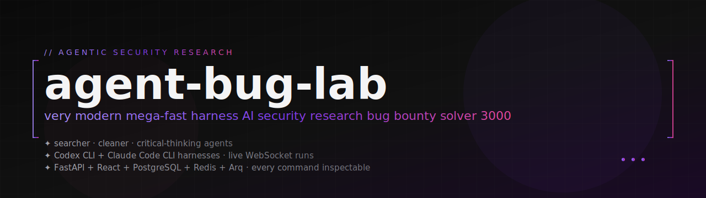
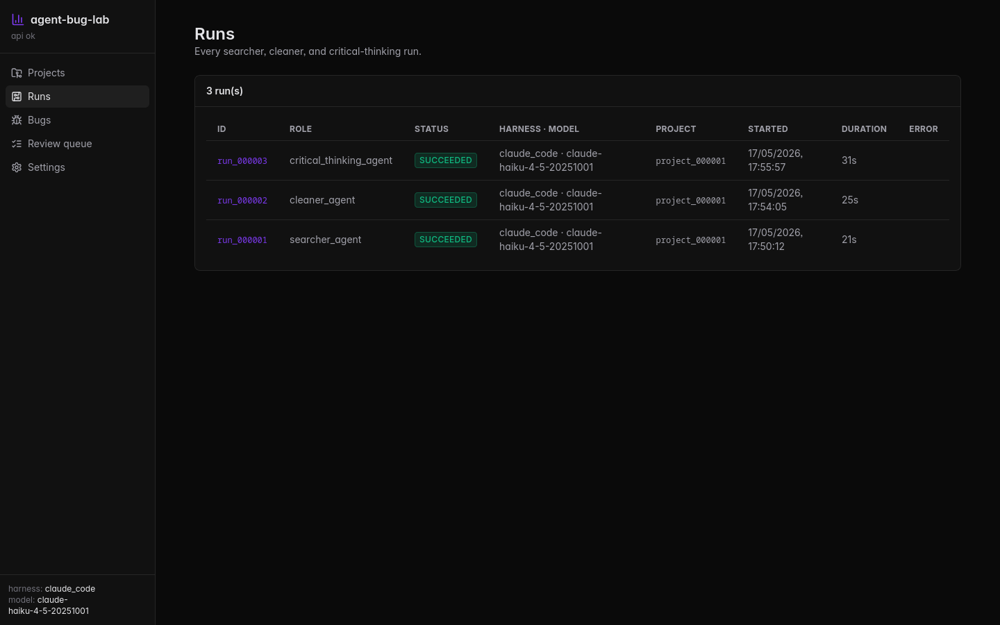
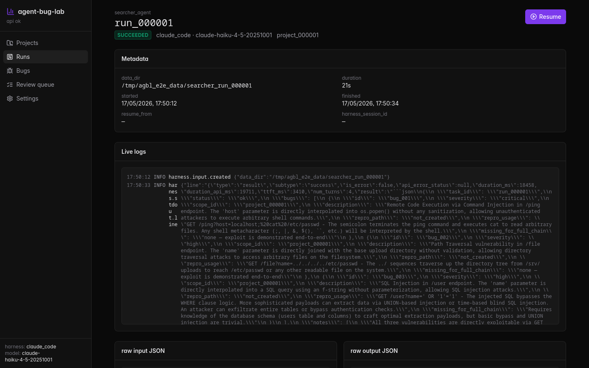
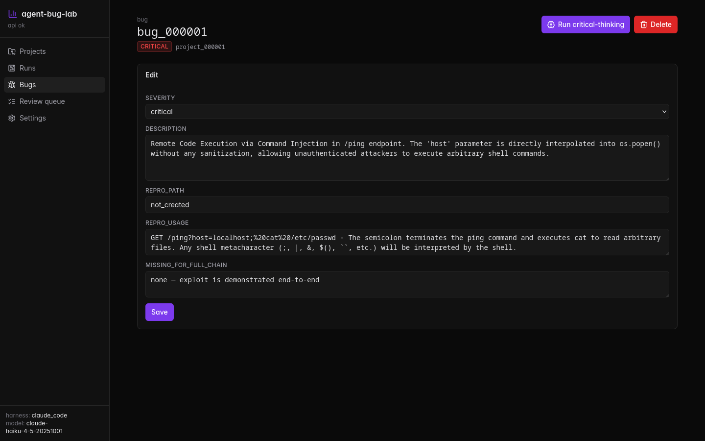
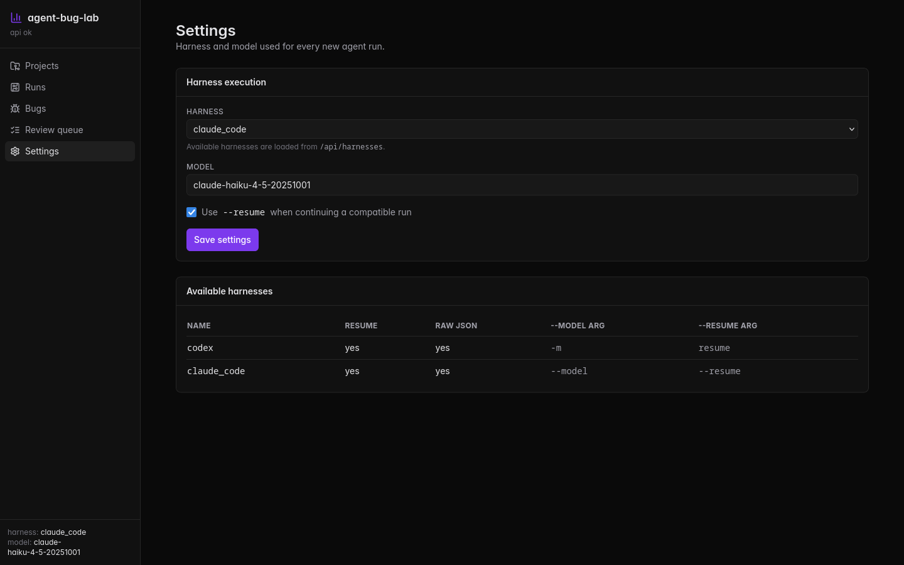

<div align="center">



<h1>agent-bug-lab</h1>

<p><strong>A very modern, mega-fast harness AI security research bug bounty solver 3000.</strong></p>

<p>An observable, target-agnostic workbench that orchestrates LLM coding agents
(<a href="https://github.com/openai/codex">Codex CLI</a>, <a href="https://docs.anthropic.com/en/docs/agents-and-tools/claude-code/overview">Claude Code CLI</a>)
through three roles — <b>searcher</b>, <b>cleaner</b>, and <b>critical-thinking</b> —
to hunt, triage, and refine candidate security bugs across an arbitrary codebase.
Every harness command, every JSON I/O, every log line is inspectable in the UI.</p>

<p>
  <a href="#"></a>
  <a href="#"></a>
  <br/>
  
  
  
  
  
  
  
  
  <br/>
  
  
  
  
  
  
  <br/>
  
  
</p>

</div>

## Showcase

Captures from a demo run against a synthetic vulnerable Flask target that
ships with the project for local testing. **No real-world programs were
analyzed for these screenshots, and no claims are made about any third
party's software.** Use the harness only against targets you are explicitly
authorized to test.

<table>
  <tr>
    <td width="50%" align="center" valign="top">
      <a href="./docs/screenshots/01-runs-index.png">
        
      </a>
      <br/><sub><b>Runs index.</b> Every <code>searcher_agent</code>, <code>cleaner_agent</code>, and <code>critical_thinking_agent</code> execution side by side, with harness, model, duration, and status.</sub>
    </td>
    <td width="50%" align="center" valign="top">
      <a href="./docs/screenshots/02-run-detail.png">
        
      </a>
      <br/><sub><b>Run detail.</b> WebSocket-driven duration ticker, streaming logs, plus side-by-side raw input and raw output JSON for the harness invocation.</sub>
    </td>
  </tr>
  <tr>
    <td width="50%" align="center" valign="top">
      <a href="./docs/screenshots/03-bug-detail.png">
        
      </a>
      <br/><sub><b>Bug detail.</b> Edit severity, scope, description, repro, and the explicit <code>missing_for_full_chain</code> field — every candidate is stored, even incomplete ones.</sub>
    </td>
    <td width="50%" align="center" valign="top">
      <a href="./docs/screenshots/04-settings.png">
        
      </a>
      <br/><sub><b>Settings.</b> Pick the harness (<code>codex</code> or <code>claude_code</code>) and the model; toggle <code>--resume</code> for compatible CLIs. Changes apply to the next queued run.</sub>
    </td>
  </tr>
</table>

---

## Why

LLM coding agents are great at reading a codebase and surfacing plausible
security bugs, but the *plumbing* around them is usually invisible: which
prompt was sent, which scope it was filed under, what the cleaner threw away,
what the resumed run carried forward. **agent-bug-lab** is that plumbing as
a first-class product.

- ⚡ **Mega-fast harness** — agents stream stdout/stderr live over WebSocket; the run-detail page ticks every second while a run is in flight.
- 🧠 **Three roles, one loop** — `searcher_agent` finds candidate bugs; `cleaner_agent` triages weak ones; `critical_thinking_agent` sharpens survivors.
- 🧪 **Real harnesses only** — invokes the actual `codex` / `claude` CLIs as subprocesses with `--model` and `--resume`; no mocks, no toy.
- 🗂 **Scopes as research directions** — every project ships 11 preliminary categories (memory safety, IPC trust boundary, race conditions, …); agents may freely create or rename scopes (never delete), and may retag only the bugs they themselves produced.
- 🧾 **Forensic by default** — every run gets its own `data/<role>_<id>/` directory with `harness_command.json`, `input.json`, `output.json`, `stdout.log`, `stderr.log`, `validated_bugs.json`, plus all structured events archived in `agent_logs`.
- 🎯 **Target-agnostic** — point `FIXED_REPO_ROOT` at any read-only repository you are explicitly authorized to test.

> ### ⚠ Responsible use
>
> This is an experimental research workbench. Only point it at repositories
> you are explicitly permitted to analyze — your own code, CTF/training
> targets, or programs whose bug-bounty rules explicitly allow AI-assisted
> static analysis. Treat any output as a *candidate* for human review, not a
> confirmed vulnerability; never disclose agent output as a finding without
> manual reproduction and the target program's coordinated-disclosure
> process. The harnesses run **read-only** by design — agents cannot modify
> the target tree.

## Architecture

```
                              ┌─────────────────────────────────────┐
                              │  apps/web (React + TS + Vite)       │
                              │  • projects · runs · bugs · scopes  │
                              │  • live WebSocket logs              │
                              └──────────────┬──────────────────────┘
                                             │ HTTP + WS  (/api/*)
                              ┌──────────────▼──────────────────────┐
                              │  apps/api (FastAPI + Pydantic v2)   │
                              │  • REST + WebSocket                  │
                              │  • SQLAlchemy 2 / Alembic            │
                              └──┬───────────────────┬───────────────┘
                                 │ enqueue            │ DB
                              ┌──▼───────────┐   ┌────▼──────────────┐
                              │  Redis       │   │  PostgreSQL 16    │
                              │  (arq queue) │   │  source of truth  │
                              └──┬───────────┘   └───────────────────┘
                                 │ pop
                              ┌──▼──────────────────────────────────┐
                              │  Arq workers                        │
                              │  • searcher_worker                  │
                              │  • cleaner_worker                   │
                              │  • critical_worker                  │
                              └──┬──────────────────────────────────┘
                                 │ subprocess (read-only sandbox)
                              ┌──▼──────────────┬───────────────────┐
                              │  codex CLI      │  claude CLI       │
                              │  exec --json    │  -p --output json │
                              └──┬──────────────┴────┬──────────────┘
                                 │                   │
                                 ▼                   ▼
                            ┌────────────────────────────┐
                            │ target repo (read-only)    │
                            │ FIXED_REPO_ROOT            │
                            └────────────────────────────┘
```

A single `HarnessRunner` ABC owns CLI invocation; adding a new harness is one
subclass. A single `drive_run` helper owns the queued → running → succeeded
state machine; the three worker entry points are 4-line shims that supply a
role-specific `apply_output` callback.

## Quick start (Docker)

```bash
cp .env.example .env

# Mount the target repo you want the agents to read:
export FIXED_REPO_ROOT_HOST=/abs/path/to/your/target/repo

docker compose up --build
```

Open <http://localhost:8000/docs> for the interactive API.
Build the web UI separately with `cd apps/web && npm install && npm run dev`
(<http://localhost:5173>).

## Local dev (no Docker)

```bash
# Postgres + Redis running on localhost
cd apps/api
uv venv && uv pip install -e .
alembic upgrade head
uvicorn app.main:app --reload --port 8000

# in a second shell
arq app.workers.arq_settings.WorkerSettings

# in a third shell
cd apps/web && npm install && npm run dev
```

The `claude` and `codex` CLIs must be on `$PATH`. Switch between them at any
time from `Settings → Harness`; the running worker picks the change up on the
next job.

## Selected endpoints

| Method · Route                                  | What it does                                                         |
|-------------------------------------------------|----------------------------------------------------------------------|
| `POST /api/projects`                            | Create a project; auto-queues a `searcher_agent` run.                |
| `GET  /api/projects/{id}/scopes`                | List scopes (preliminary + agent-created).                           |
| `POST /api/projects/{id}/scopes`                | Human-created scope.                                                 |
| `PATCH /api/scopes/{id}`                        | Rename / re-describe a scope. **Scopes are never deleted.**          |
| `POST /api/projects/{id}/start-searcher`        | Queue another searcher run on demand.                                |
| `POST /api/review-queue/clean`                  | Run a cleaner across a selection of bugs.                            |
| `POST /api/review-queue/critical`               | Refine one bug with the critical-thinking agent.                     |
| `POST /api/runs/{id}/resume`                    | Resume a searcher session via `--resume <harness_session_id>`.       |
| `GET  /api/runs/{id}/logs`                      | Paginated log rows.                                                  |
| `WS   /api/runs/{id}/ws`                        | Live stream: `{kind:"run"|"log"|"tick"|"end"|"error"}`               |

## The agent contract

Every harness invocation receives a single JSON blob describing its task:

```json
{
  "task_id": "run_000042",
  "role": "searcher_agent",
  "project": {
    "id": "project_000001",
    "name": "example-target",
    "bug_bounty_url": "https://example.com/bug-bounty",
    "repo_path": "/workspace/target",
    "scopes": [
      { "id": "scope_memory_safety__project_000001",   "name": "Memory safety",    "description": "…" },
      { "id": "scope_input_validation__project_000001","name": "Input validation", "description": "…" }
    ]
  },
  "objective": "<the role-specific prompt — see app/services/prompts.py>",
  "constraints": { "read_only": true, "max_findings": 5, ... }
}
```

Agents reply with strict JSON. For the searcher (example using the synthetic
demo target):

```json
{
  "task_id": "run_000042",
  "status": "ok",
  "scope_ops": {
    "create": [{ "id": "scope_demo_examples", "name": "Demo examples", "description": "Pedagogical findings in the bundled Flask target." }]
  },
  "bugs": [
    {
      "id": "bug_x",
      "severity": "high",
      "scope_id": "scope_input_validation__project_000001",
      "description": "SQL injection in the /user endpoint: the `name` query parameter is interpolated into a raw SQL string without parameterisation.",
      "repro_path": "not_created",
      "repro_usage": "curl 'http://localhost:5000/user?name=%27+OR+%271%27%3D%271'",
      "missing_for_full_chain": "Need a populated users.db to demonstrate exfiltration end-to-end."
    }
  ],
  "notes": [],
  "harness_session_id": "..."
}
```

Cleaner and critical-thinking have analogous schemas — see
[`packages/shared/schemas/`](./packages/shared/schemas/).

## Scopes

Scopes are research-direction *groupings* of issues, not bounty-program
target lists. Every project starts with 11 preliminary scopes that the seeded
vocabulary covers:

| seed id                       | name                    |
|-------------------------------|-------------------------|
| `scope_memory_safety`         | Memory safety           |
| `scope_authentication`        | Authentication          |
| `scope_authorization`         | Authorization           |
| `scope_input_validation`      | Input validation        |
| `scope_cryptography`          | Cryptography            |
| `scope_ipc_boundary`          | IPC trust boundary      |
| `scope_race_conditions`       | Race conditions         |
| `scope_denial_of_service`     | Denial of service       |
| `scope_information_disclosure`| Information disclosure  |
| `scope_supply_chain`          | Supply chain            |
| `scope_logic_flaws`           | Logic flaws             |

**Agents may**: create new scopes, rename existing ones, reassign bugs they themselves produced.
**Agents may not**: delete scopes (any `delete` entries are silently dropped), or retag bugs owned by other runs.

## Layout

```
apps/api/                FastAPI backend + Arq workers (Python 3.13)
  alembic/versions/      schema migrations (Postgres)
  app/api/routes/        REST + WebSocket endpoints
  app/services/          harness runner, scope service, ingest, cleaner, critical
  app/workers/           Arq entry points + the shared run-lifecycle driver
apps/web/                React + Vite frontend
  src/pages/             Projects / Runs / Bugs / ReviewQueue / Settings
  src/hooks/             useRunStream — one WebSocket per run-detail page
packages/shared/schemas/ Draft 2020-12 JSON schemas shared with the contract
data/                    run artifacts (gitignored)
SPEC.md                  the original product spec, kept verbatim
AGENTS.md                contributor / agent design notes
```

## Configuration

All knobs live in [`.env.example`](./.env.example):

| variable                  | meaning                                       |
|---------------------------|-----------------------------------------------|
| `DATABASE_URL`            | Postgres DSN. Use `127.0.0.1` not `localhost`.|
| `REDIS_URL`               | Arq queue + log pub/sub (future).             |
| `DATA_DIR`                | Where run artifacts land. Default `./data`.   |
| `FIXED_REPO_ROOT`         | The target repository (read-only).            |
| `CODEX_CLI_BIN`           | Path to `codex`; falls back to `$PATH`.       |
| `CLAUDE_CODE_CLI_BIN`     | Path to `claude`; falls back to `$PATH`.      |
| `DEFAULT_HARNESS`         | `codex` or `claude_code`.                     |
| `DEFAULT_MODEL`           | e.g. `claude-haiku-4-5-20251001`.             |
| `RUN_TIMEOUT_SECONDS`     | Per-run wall clock budget.                    |
| `REVIEW_STALE_AFTER_DAYS` | Bugs reappear in the review queue after this. |

## Roadmap

- [ ] Cloud-hosted SaaS variant
- [ ] CI for backend (ruff + alembic offline + pytest) and frontend (tsc)
- [ ] More harnesses (Aider, Cursor CLI, OpenHands)
- [ ] Per-finding cost accounting from the harness envelope
- [ ] Cross-project scope vocabulary sharing

## Contributing

PRs welcome. The codebase tries hard to stay DRY/KISS/SOLID — see
[`AGENTS.md`](./AGENTS.md) for the design constraints, then dive in.

## License

[MIT](./LICENSE).
